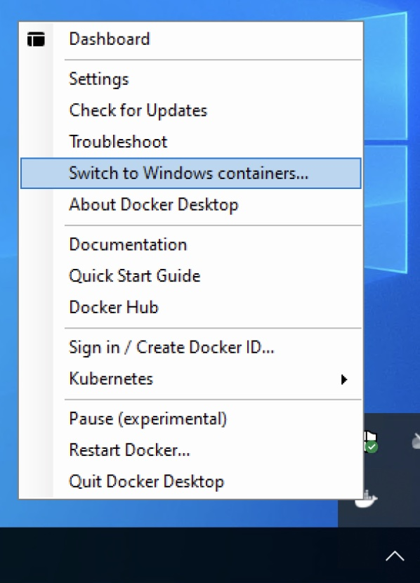

# Docker Desktop for Windows

## Windows 8, 10, 11

Start off by running:
```ps
Enable-WindowsOptionalFeature -Online -FeatureName Containers –All -NoRestart
Enable-WindowsOptionalFeature -Online -FeatureName Microsoft-Hyper-V –All -NoRestart
shutdown /r /t 1
```

After the system has restarted, install Docker Desktop from [Docker.com: Docker Desktop for Windows](https://docs.docker.com/desktop/windows/install/). After installation, right-click the Docker Desktop menu in your task bar tray. Select Switch to Windows containers to use Windows containers as the default.

